[](https://classroom.github.com/a/vbnbTt5m)
[](https://classroom.github.com/online_ide?assignment_repo_id=15291973&assignment_repo_type=AssignmentRepo)
# Dev_Setup
Setup Development Environment

#Assignment: Setting Up Your Developer Environment

#Objective:
This assignment aims to familiarize you with the tools and configurations necessary to set up an efficient developer environment for software engineering projects. Completing this assignment will give you the skills required to set up a robust and productive workspace conducive to coding, debugging, version control, and collaboration.

#Tasks:

1. Select Your Operating System (OS):
Choose an operating system that best suits your preferences and project requirements. Download and Install Windows 11. https://www.microsoft.com/software-download/windows11

2. Install a Text Editor or Integrated Development Environment (IDE):
Select and install a text editor or IDE suitable for your programming languages and workflow. Download and Install Visual Studio Code. https://code.visualstudio.com/Download
3. Set Up Version Control System:
Install Git and configure it on your local machine. Create a GitHub account for hosting your repositories. Initialize a Git repository for your project and make your first commit. https://github.com

4. Install Necessary Programming Languages and Runtimes:
Instal Python from http://wwww.python.org programming language required for your project and install their respective compilers, interpreters, or runtimes. Ensure you have the necessary tools to build and execute your code.

5. Install Package Managers:
If applicable, install package managers like pip (Python).

6. Configure a Database (MySQL):
Download and install MySQL database. https://dev.mysql.com/downloads/windows/installer/5.7.html

7. Set Up Development Environments and Virtualization (Optional):
Consider using virtualization tools like Docker or virtual machines to isolate project dependencies and ensure consistent environments across different machines.

8. Explore Extensions and Plugins:
Explore available extensions, plugins, and add-ons for your chosen text editor or IDE to enhance functionality, such as syntax highlighting, linting, code formatting, and version control integration.

9. Document Your Setup:
Create a comprehensive document outlining the steps you've taken to set up your developer environment. Include any configurations, customizations, or troubleshooting steps encountered during the process. 

#Deliverables:
- Document detailing the setup process with step-by-step instructions and screenshots where necessary.
- A GitHub repository containing a sample project initialized with Git and any necessary configuration files (e.g., .gitignore).
- A reflection on the challenges faced during setup and strategies employed to overcome them.

#Submission:
Submit your document and GitHub repository link through the designated platform or email to the instructor by the specified deadline.

#Evaluation Criteria:**
- Completeness and accuracy of setup documentation.
- Effectiveness of version control implementation.
- Appropriateness of tools selected for the project requirements.
- Clarity of reflection on challenges and solutions encountered.
- Adherence to submission guidelines and deadlines.

Note: Feel free to reach out for clarification or assistance with any aspect of the assignment.
#Answers to SE-Assignment-1

Steps for Setting Up Your Developer Environment:
# Installing Windows 11

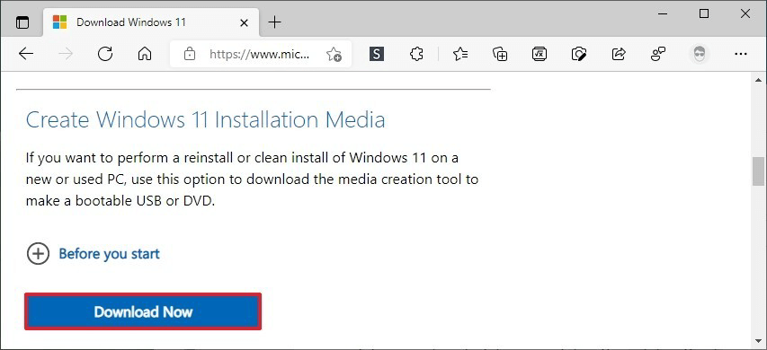

1. Visit the [Windows 11 download page](https://www.microsoft.com/software-download/windows11) and select "Create Installation Media".
   
2. Agree to the terms and select "Use the recommended options for this PC". Choose "USB flash drive" and follow the prompts to create the installation media.

3. Restart your PC and boot from the USB drive:
   
- Enter BIOS/UEFI settings (usually by pressing F2, F10, Del, or Esc during startup).
- Change the boot order to boot from USB first.

4. Follow the on-screen instructions to install Windows 11, including:

- Selecting a language.
- Choosing the edition of Windows 11 that matches your previous Windows 10 installation.
- Formatting the drive (if necessary).
- Completing the installation and setup process.


# Installing Visual Studio Code

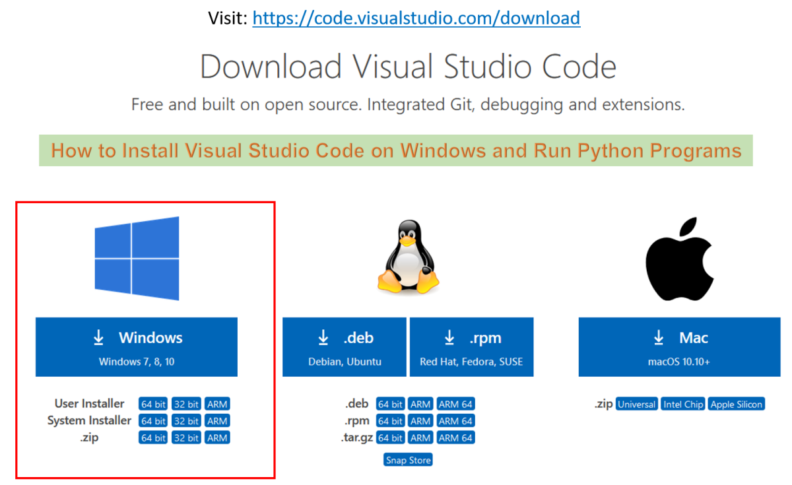

1. Download Visual Studio Code from [Visual Studio Code](https://code.visualstudio.com/).

2. Run the installer and follow these steps:

- Accept the license agreement.
- Select the installation location.
- Choose additional tasks (e.g., adding VS Code to the system PATH, creating a desktop icon).
- Complete the installation.


3. Launch Visual Studio Code and customize settings, such as:

- Installing themes.
- Configuring keyboard shortcuts.
- Adjusting editor settings (e.g., tab size, font).

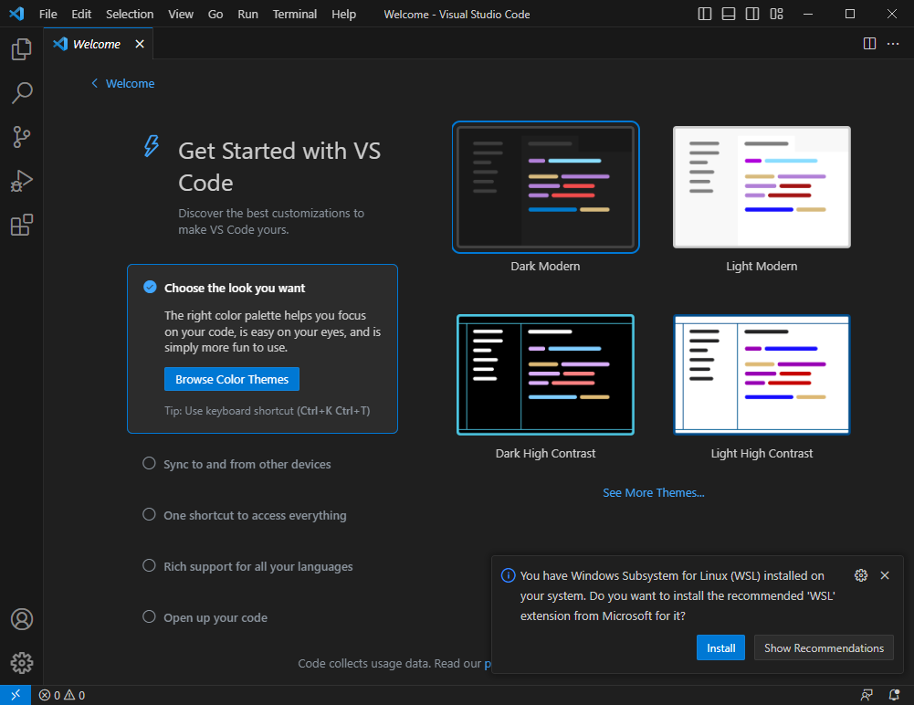


# Version Control Setup

1. Download and install Git from [Git for Windows](https://gitforwindows.org/).

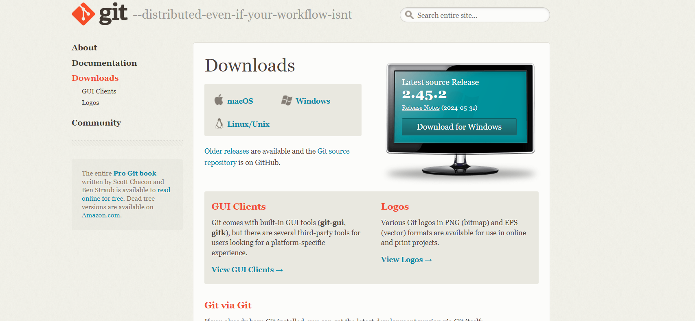

2. During installation, choose options like using Git from the command prompt and configuring line ending conversions.

3. Create a GitHub account at [GitHub](https://github.com) if you don't have one.

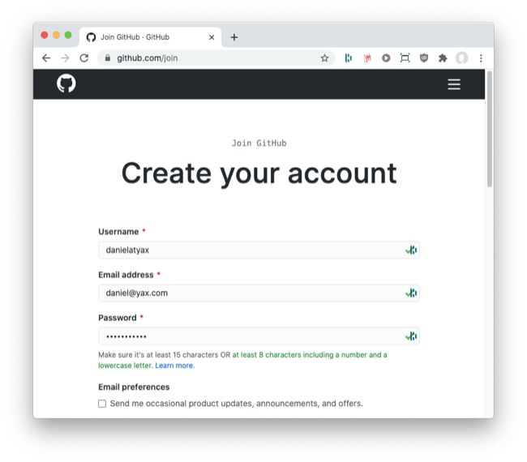

4. Configure Git with your username and email:
```bash
git config --global user.name "Your Name"
git config --global user.email "your.email@example.com"


5. Initialize a new Git repository and make your first commit:
mkdir project_name
cd project_name
git init
echo "# Project Title" >> README.md
git add .
git commit -m "Initial commit"
git remote add origin https://github.com/yourusername/your-repo.git
git push -u origin master

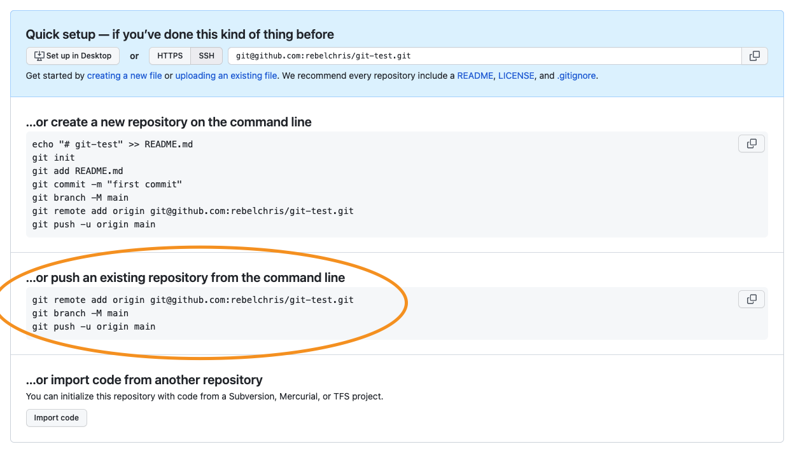


# Python Installation

4. Download Python from [Python](https://www.python.org).

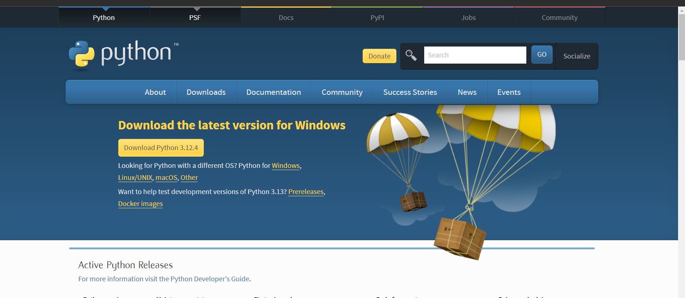

5. Run the installer:

- Ensure you check "Add Python to PATH".
- Select "Install Now" or customize the installation for additional features.

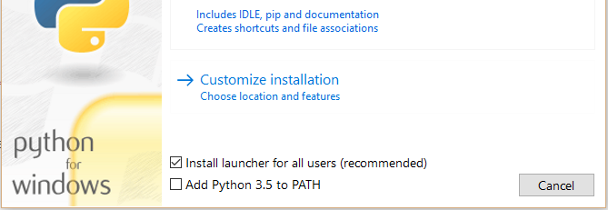

6. Verify the installation by opening a command prompt and running:
```bash
python --version
pip --version


Install additional packages using pip as needed, for example:
pip install numpy pandas flask
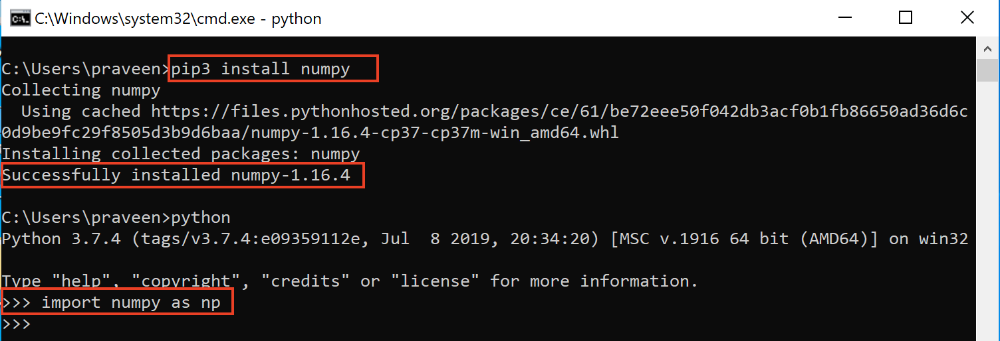

# Installing Package Managers

- pip is installed with Python. Verify by running `pip --version`.

For Node.js projects, install npm or yarn from [Node.js](https://nodejs.org/) or [Yarn](https://yarnpkg.com/getting-started/install).

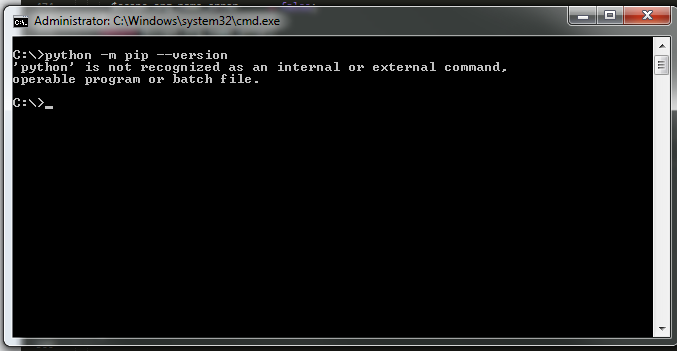

# Installing and Configuring MySQL

1. Download MySQL installer from [MySQL](https://www.mysql.com).

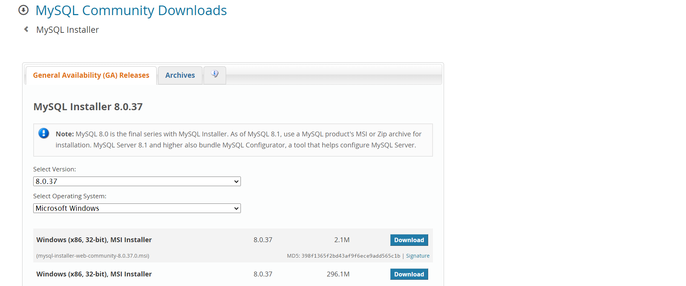

2. Run the installer and follow these steps:

- Select "Developer Default" for a typical setup.
- Proceed through the setup, installing necessary MySQL products.

3. Configure MySQL Server:

- Set a strong root password.
- Optionally create additional user accounts.

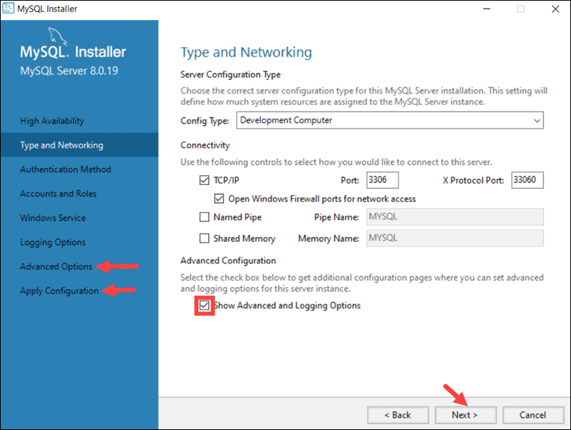

4. Start the MySQL server and verify the connection using MySQL Workbench or the command line:

```bash
mysql -u root -p


# Installing Extensions and Plugins

Open Visual Studio Code, go to the Extensions view (Ctrl+Shift+X), and install desired extensions. Some recommended extensions include:

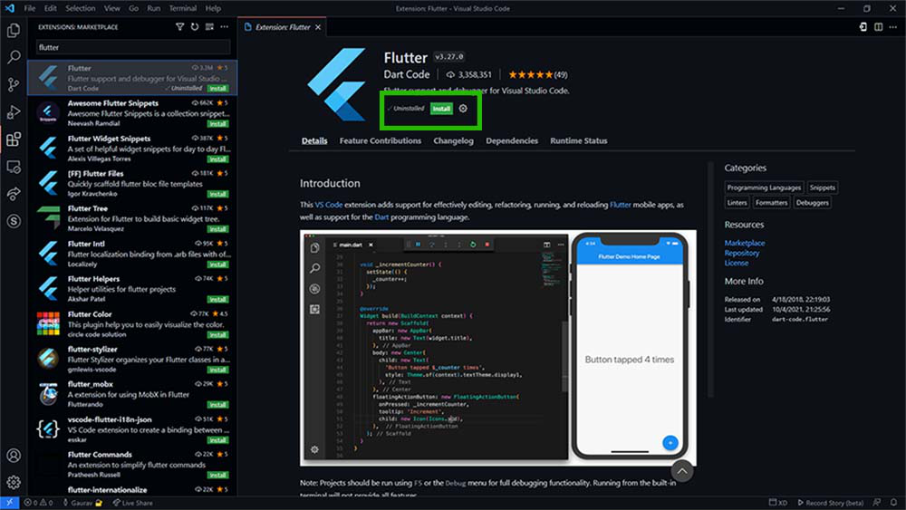

- Flutter files: Adds support for Flutter development.
- Auto Close Tag: Automatically adds a closing tag when you complete the opening tag.
- Auto Complete Tag: Auto-completes HTML tags.
- C/C++: Adds language support for C/C++.
- Code Runner: Enables running code snippets quickly.
- Color Highlight: Highlights colors in your code.
- Dart: Adds support for Dart programming.
- Django IntelliSense: Provides Django-specific code intelligence.


# Challenges Faced During Setup and Solutions:
Compatibility Issues:

Challenge: Encountered errors during the installation of some tools due to OS incompatibility.

Solution: Consulted the official troubleshooting guides and forums provided by the software vendors e.g., Microsoft's troubleshooting for Windows 11 installation issues). Checked system requirements and ensured hardware compatibility.


Network Issues:

Challenge: Slow or interrupted downloads during the installation of large files or tools.

Solution: Used a reliable download manager (e.g., Free Download Manager) to manage and resume downloads efficiently. Ensured a stable internet connection and tried downloading during off-peak hours.


Extension Conflicts or Performance Issues:

Challenge: Some extensions caused conflicts or degraded the performance of Visual Studio Code.

Solution: Reviewed user ratings and documentation to identify stable and well-supported extensions. Disabled or uninstalled conflicting extensions and sought alternative extensions that offered similar functionality.


Connection Errors with MySQL Database:

Challenge: Faced connection issues between the application and MySQL database.

Solution: Verified that the MySQL server was running and accessible on the correct port (default is 3306). Checked firewall settings to allow MySQL connections. Tested the connection using MySQL Workbench and resolved any authentication issues by resetting user credentials if necessary.